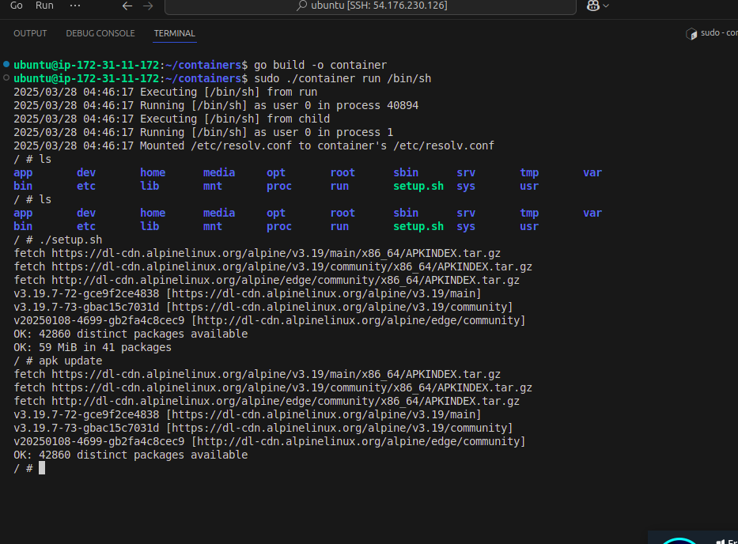
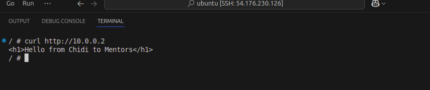
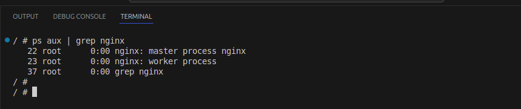
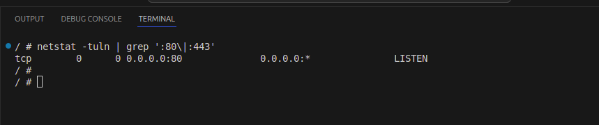
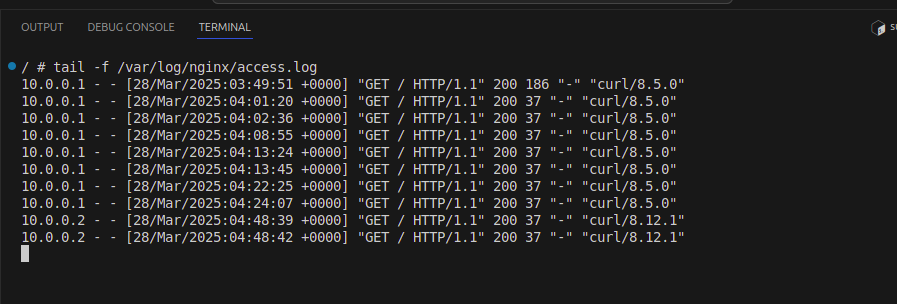
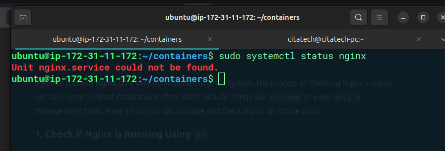

# Containerized Nginx Web Server Documentation

## 1. Overview

This project implements a lightweight container in Go that runs an Nginx web server on an Alpine Linux root filesystem. The container enforces a CPU limit using cgroups, configures a virtual network for internal and external access, and serves a static HTML page with the message "Hello from Chidi to Mentors." The solution evolved from running a basic shell and a Python script to a persistent web server accessible from outside the host machine (e.g., an AWS EC2 instance with IP`).

### Key Features
- **Containerization**: Utilizes Linux namespaces (`UTS`, `PID`, `NS`, `USER`, `NET`) for isolation.
- **Resource Limits**: Applies a CPU quota via cgroups.
- **Networking**: Sets up a veth pair and NAT for external access.
- **Web Server**: Runs Nginx with a custom static page, persistent after shell exit.

---

## Prerequisites
- **Ubuntu 24.04**: Tested on this version.
- **Go**: Install with `sudo apt install golang-go`.
- **Root Privileges**: Required for namespace and network operations (`sudo`).
- **Minimal Root Filesystem**: A directory like `./alpine_fs` with a basic Alpine Linux filesystem (e.g., extracted from an Alpine minirootfs tarball).


## Setup
1. **Install Go**:
   ```bash
   sudo apt update
   sudo apt install golang-go
   go version  # Should show go1.22 or later
   ```
2. **Create Project**:
   ```bash
   mkdir ~/containers
   cd ~/containers
   touch main.go
   ```


## 2. Container Setup

The core implementation resides in `main.go`, leveraging Go’s `os/exec` and `syscall` packages to create a containerized environment.


### Part 1: Isolated Environment

#### Process Isolation with Namespaces
- **PID Namespace**: Isolates process IDs so the container has its own PID 1.
- **User Namespace**: Maps container root (UID 0) to a non-root user on the host.
- **Network Namespace**: Provides a separate network stack.
- **Mount Namespace**: Isolates mount points.

### Main Structure
```go
package main

import (
    "fmt"
    "log"
    "os"
    "os/exec"
    "path/filepath"
    "strconv"
    "syscall"
    "golang.org/x/sys/unix"
)

const (
    ContainerName = "mycontainer"
    VethHost      = "veth0"
    VethContainer = "veth1"
    ContainerIP   = "10.0.0.2/24"
    HostIP        = "10.0.0.1/24"
    Gateway       = "10.0.0.1"
    RootFS        = "./alpine_fs"
)

func main() {
    if len(os.Args) < 2 {
        log.Fatal("Expected at least one argument: run or child")
    }
    switch os.Args[1] {
    case "run":
        run(os.Args[2:]...)
    case "child":
        child(os.Args[2:]...)
    default:
        log.Fatal("Unknown command. Use run <command_name>")
    }
}
```
- **Entry Point**: Accepts `run` or `child` commands. `run` initiates the container, and `child` executes inside it.
- **Constants**: Define network settings and the root filesystem path.

### Run Function
```go
func run(command ...string) {
    log.Println("Executing", command, "from run")
    log.Printf("Running %v as user %d in process %d\n", os.Args[2:], os.Geteuid(), os.Getpid())

    pid := os.Getpid()
    setupCgroups(pid)

    cmd := exec.Command("/proc/self/exe", append([]string{"child"}, command...)...)
    cmd.Stdin = os.Stdin
    cmd.Stdout = os.Stdout
    cmd.Stderr = os.Stderr
    cmd.SysProcAttr = &syscall.SysProcAttr{
        Cloneflags:   syscall.CLONE_NEWUTS | syscall.CLONE_NEWPID | syscall.CLONE_NEWNS | syscall.CLONE_NEWUSER | syscall.CLONE_NEWNET,
        Unshareflags: syscall.CLONE_NEWNS,
        UidMappings:  []syscall.SysProcIDMap{{ContainerID: 0, HostID: os.Getuid(), Size: 1}},
        GidMappings:  []syscall.SysProcIDMap{{ContainerID: 0, HostID: os.Getgid(), Size: 1}},
        AmbientCaps:  []uintptr{unix.CAP_NET_ADMIN, unix.CAP_SYS_ADMIN},
    }

    must(createNetworkNamespace(ContainerName))
    must(cmd.Start())
    must(setupHostNetwork(cmd.Process.Pid))

    rm := &ResourceManager{containerName: ContainerName, vethHost: VethHost, mounts: []string{"/var/run/netns/" + ContainerName}, namespaces: []string{"net"}}
    must(cmd.Wait())
    if err := rm.cleanup(); err != nil {
        log.Printf("Cleanup failed: %v", err)
    }
}
```
- **Namespaces**: Uses `CLONE_NEWUTS` (hostname), `CLONE_NEWPID` (PID isolation), `CLONE_NEWNS` (mounts), `CLONE_NEWUSER` (user mapping), and `CLONE_NEWNET` (network isolation).
- **Capabilities**: Grants `CAP_NET_ADMIN` and `CAP_SYS_ADMIN` for network and system operations.
- **Process**: Forks a child process via `/proc/self/exe child`, passing the command (e.g., `/bin/sh`).

---

## 3. Networking

Networking enables the container to serve web content internally (`10.0.0.2`) 


**Implementation**:
- `setupHostNetwork()` creates and configures the host side of the veth pair with NAT.
- `setupContainerNetwork()` configures the container’s network stack with IP and routing.

### Host Network Setup
```go
func setupHostNetwork(pid int) error {
    cmd := exec.Command("ip", "link", "add", VethHost, "type", "veth", "peer", "name", VethContainer)
    if output, err := cmd.CombinedOutput(); err != nil {
        return fmt.Errorf("failed to create veth pair: %v\nOutput: %s", err, output)
    }

    cmd = exec.Command("ip", "link", "set", VethContainer, "netns", fmt.Sprintf("%d", pid))
    if output, err := cmd.CombinedOutput(); err != nil {
        return fmt.Errorf("failed to move veth to container: %v\nOutput: %s", err, output)
    }

    cmd = exec.Command("ip", "link", "set", VethHost, "up")
    if output, err := cmd.CombinedOutput(); err != nil {
        return fmt.Errorf("failed to bring up host interface: %v\nOutput: %s", err, output)
    }

    cmd = exec.Command("ip", "addr", "add", HostIP, "dev", VethHost)
    if output, err := cmd.CombinedOutput(); err != nil {
        return fmt.Errorf("failed to assign IP to host interface: %v\nOutput: %s", err, output)
    }

    cmds := [][]string{
        {"sysctl", "-w", "net.ipv4.ip_forward=1"},
        {"iptables", "-t", "nat", "-A", "POSTROUTING", "-s", "10.0.0.0/24", "-j", "MASQUERADE"},
        {"iptables", "-A", "FORWARD", "-o", VethHost, "-j", "ACCEPT"},
        {"iptables", "-A", "FORWARD", "-i", VethHost, "-j", "ACCEPT"},
    }
    for _, args := range cmds {
        cmd = exec.Command(args[0], args[1:]...)
        if output, err := cmd.CombinedOutput(); err != nil {
            return fmt.Errorf("failed %v: %v\nOutput: %s", args, err, output)
        }
    }
    return nil
}
```
- **Veth Pair**: Creates `veth0` (host) and `veth1` (container) for network connectivity.
- **IP Assignment**: Assigns `10.0.0.1/24` to `veth0`.
- **Namespace Move**: Transfers `veth1` to the container’s network namespace.
- **Forwarding**: Enables IP forwarding and configures NAT masquerading for the `10.0.0.0/24` subnet.

### Container Network Setup
```go
func setupContainerNetwork() error {
    if err := exec.Command("/usr/sbin/ip", "link", "set", "lo", "up").Run(); err != nil {
        return fmt.Errorf("failed to bring up lo: %v", err)
    }
    if err := exec.Command("/usr/sbin/ip", "link", "set", VethContainer, "up").Run(); err != nil {
        return fmt.Errorf("failed to bring up veth: %v", err)
    }
    if err := exec.Command("/usr/sbin/ip", "addr", "add", ContainerIP, "dev", VethContainer).Run(); err != nil {
        return fmt.Errorf("failed to assign IP to veth: %v", err)
    }
    if err := exec.Command("/usr/sbin/ip", "route", "add", "default", "via", Gateway).Run(); err != nil {
        return fmt.Errorf("failed to add default route: %v", err)
    }
    return nil
}
```
- **Interface Activation**: Activates `lo` and `veth1` inside the container.
- **IP Assignment**: Assigns `10.0.0.2/24` to `veth1`.
- **Routing**: Sets the default gateway to `10.0.0.1`.

### External Access
To allow access from outside the host (e.g., `54.176.230.126`):
- **Manual Host Configuration**: Added an iptables DNAT rule on the host:
  ```bash
  sudo iptables -t nat -A PREROUTING -p tcp -d 54.176.230.126 --dport 80 -j DNAT --to-destination 10.0.0.2:80
  ```

---

## 4. Cgroups

Resource limits are enforced using cgroups to cap CPU usage.

```go
func setupCgroups(pid int) {
    cgroups := "/sys/fs/cgroup/"
    containerDir := filepath.Join(cgroups, "go_container/")
    
    if err := os.MkdirAll(containerDir, 0755); err != nil {
        log.Printf("Failed to create cgroup directory: %v", err)
        panic(err)
    }

    if err := os.WriteFile(filepath.Join(cgroups, "cgroup.subtree_control"), []byte("+cpu +pids"), 0700); err != nil {
        log.Printf("Failed to enable cpu and pids controllers: %v", err)
    }

    must(os.WriteFile(filepath.Join(containerDir, "pids.max"), []byte("20"), 0700))
    must(os.WriteFile(filepath.Join(containerDir, "cpu.max"), []byte("50000 100000"), 0700))
    must(os.WriteFile(filepath.Join(containerDir, "cgroup.procs"), []byte(strconv.Itoa(pid)), 0700))
}
```
- **Directory**: Creates `/sys/fs/cgroup/go_container/` for the container’s cgroup.
- **Controllers**: Enables `cpu` and `pids` controllers in the parent cgroup.
- **Limits**: Sets `pids.max=20` (max processes) and `cpu.max=50000 100000` (50% CPU over a 100ms period).

---

## 5. Root Filesystem

The container uses an Alpine Linux root filesystem, with an Ubuntu option explored during development.

### Alpine Setup (Minmal Linux Env)
- **Source**: Downloaded `alpine-minirootfs-3.19.1-x86_64.tar.gz` from `https://dl-cdn.alpinelinux.org/alpine/v3.19/releases/x86_64/`.
- **Extraction**: Unpacked into `./alpine_fs`:
  ```bash
  sudo tar -xzf alpine-minirootfs-3.19.1-x86_64.tar.gz -C ./alpine_fs
  ```
- **Mounting**: Applied in the `child` function:
  ```go
  must(syscall.Chroot(RootFS))
  must(os.Chdir("/"))
  ```


## Application Deployment

## 6. Nginx Implementation

The final task focused on running an Nginx web server inside the container.

### Child Function
```go
func child(command ...string) {
    log.Println("Executing", command, "from child")
    log.Printf("Running %v as user %d in process %d\n", os.Args[2:], os.Geteuid(), os.Getpid())

    must(setupContainerNetwork())
    must(syscall.Sethostname([]byte("container")))
    must(syscall.Chroot(RootFS))
    must(os.Chdir("/"))

    must(os.MkdirAll("/etc", 0755))
    must(os.MkdirAll("/sys", 0755))
    must(os.MkdirAll("/dev", 0755))
    must(os.MkdirAll("/proc", 0755))

    must(setupDNS())
    must(syscall.Mount("proc", "/proc", "proc", 0, ""))
    defer syscall.Unmount("/proc", 0)
    must(syscall.Mount("sysfs", "/sys", "sysfs", syscall.MS_RDONLY, ""))
    defer syscall.Unmount("/sys", 0)

    cmd := exec.Command(command[0], command[1:]...)
    cmd.Stdin = os.Stdin
    cmd.Stdout = os.Stdout
    cmd.Stderr = os.Stderr
    err := cmd.Run()
    if err != nil {
        log.Printf("Failed to run command: %v", err)
    }
}
```
- **Mounts**: Sets up `/proc` and `/sys` for a functional environment.
- **DNS**: Configures `/etc/resolv.conf` with Google DNS (`8.8.8.8`, `8.8.4.4`).
- **Command**: Executes the provided command (e.g., `/bin/sh`).

### Nginx Script (`setup_nginx.sh`)
A separate Bash script, `setup_nginx.sh`, is run manually inside the container:
```bash
#!/bin/sh
apk update
apk add nginx
mkdir -p /var/www/html
echo "<h1>Hello from Chidi to Mentors</h1>" > /var/www/html/index.html
mkdir -p /var/log/nginx
touch /var/log/nginx/error.log /var/log/nginx/access.log
cat > /etc/nginx/nginx.conf <<EOL
user root;
worker_processes 1;
error_log /var/log/nginx/error.log;
pid /run/nginx.pid;
events {
    worker_connections 1024;
}
http {
    access_log /var/log/nginx/access.log;
    server {
        listen 80;
        server_name localhost;
        root /var/www/html;
        index index.html;
    }
}
EOL
nginx
while true; do
    sleep 3600
done
```
- **Execution**: Run with `./setup_nginx.sh &` to start Nginx in the background and keep the container alive.

---

## 7. Final Configuration

### Running the Container
- **Command**: Start the container with a shell:
  ```bash
  go build -o container
  sudo ./container run /bin/sh
  ```
- **Script Execution**: Inside the container:
  ```bash
  ./setup_nginx.sh &
  exit
  ```

### External Access
- **Port Forwarding**: Configured on the host:
  ```bash
  sudo iptables -t nat -A PREROUTING -p tcp -d 54.176.230.126 --dport 80 -j DNAT --to-destination 10.0.0.2:80
  ```
- **Verification**:
  - From the host: `curl http://10.0.0.2`
  - From outside: `curl http://54.176.230.126`

---

## 8. Challenges and Solutions

1. **Resource Unavailable Error**:
   - **Issue**: Encountered `fork/exec: resource temporarily unavailable` due to PID limits.
   - **Solution**: Increased `pids.max` to 20 in `setupCgroups` and adjusted `chroot` timing.

2. **Python Dependency Conflicts**:
   - **Issue**: Initial attempts to install Python 3.11 and `py3-pip` faced version mismatches.
   - **Solution**: Pivoted to Nginx, avoiding Python dependencies.

3. **Nginx Persistence**:
   - **Issue**: Nginx stopped when exiting the shell with `nginx -g "daemon off;"`.
   - **Solution**: Used `nginx` (daemon mode) and a `while true` loop to keep the container running.

4. **External Access**:
   - **Issue**: Couldn’t access `10.0.0.2` from outside the host.
   - **Solution**: Added DNAT rule to forward traffic from `54.176.230.126:80` to `10.0.0.2:80`.

---

## 9. Screenshots


*Figure 1: High-level architecture of the container and its file system*


*Figure 2: HTML webpage *


*Figure 3: Web-server process within the container*


*Figure 4: mapped port within the container*


*Figure 5: nginx live logs within the container*


*Figure 6: nginx status within host machine (shows that our containers are isolated from the host environment)*

## 10. Conclusion

This implementation successfully delivers a containerized environment that is completely isolated from the host environment with CPU limits, network isolation, and external accessibility. Starting from a minimal Alpine base, it evolved through troubleshooting networking, resource limits, and application persistence, resulting in a functional solution akin to a simplified Docker container. We also deployed a webserver using nginx and a webpage written in html to test. 